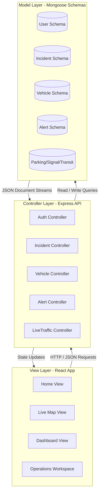
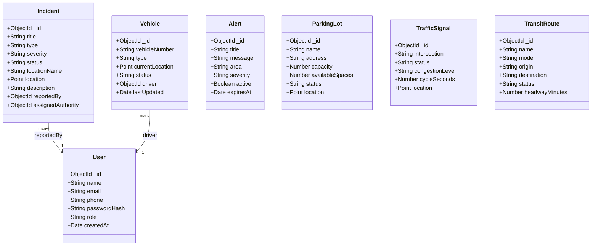

# SOFTWARE REQUIREMENT SPECIFICATION (SRS)
## TrafficEase BD - Intelligent Urban Traffic Command Platform

---

### Project Cover Page
* **Project Title:** TrafficEase BD - Dhaka Smart City Traffic Command System
* **Course:** CSE470 - Software Engineering
* **Academic Semester:** Summer 2026
* **Group ID / Section:** Group 4 / Section 01
* **Document Version:** v1.2.0 (Audit Ready)

#### Authors & Team Contribution Mappings
| Student ID | Student Name | Role / Core Contributions |
| :--- | :--- | :--- |
| **22201631** | Md. Mushroor Muttakin Khan | Lead Backend Architect, Auth Security, MongoDB Schemas, & Controller Logic |
| **22201940** | Raisha Tasnim Khan | Frontend Core UI Designer, Operations Panel, Data Bindings, & Alert Broadcasts |
| **22341036** | Sayed Sohanul Islam | GIS Engineer, Google Maps Live Traffic Overlay, Geocoding Engine, & Click-to-Pin System |
| **23301060** | Maisha Maliha Nisa | Command Workspace Lead, 30-Feature Operations Simulator, & Session Audit Logger |

---

## 1. Introduction

### 1.1 Type of Project
TrafficEase BD is a MERN Stack (MongoDB, Express.js, React.js, Node.js) web-based intelligent GIS-centered Urban Traffic Management and Command Platform. It simulates a Smart City Central Control Room designed specifically for the metropolitan traffic challenges of Dhaka, Bangladesh.

### 1.2 Purpose
The platform's primary purpose is to consolidate fragmented urban mobility telemetry (live road congestion, public transport tracking, incident logs, weather risks, parking allocations, and traffic signal control plans) into a single, cohesive, high-performance web dashboard. It enables commuters to report blocks dynamically and provides municipal authorities with a central control interface to dispatch response crews.

### 1.3 Target Users
* **Dhaka Commuters & Drivers:** To check real-time road delays, find optimal transit paths, lookup parking spaces, and submit incident logs.
* **Municipal Traffic Authorities (DMP, DTCA):** To monitor queue lengths, adjust signal cycles, verify user incident logs, and broadcast urgent road safety bulletins.

---

## 2. Technical Stack and Environment

* **Frontend:** React.js, React-Leaflet, Axios, HTML5, CSS3 (Glassmorphism layout).
* **Backend:** Node.js, Express.js, JWT Token Authentication, Bcrypt.js encryption.
* **Database:** MongoDB (via Mongoose ODM) with GIS GeoJSON spatial indexing (`2dsphere`).
* **Environment/OS Compatibility:** Fully cross-platform. Tested on Windows 10/11, macOS, and Linux (Ubuntu 22.04 LTS). Designed to run responsively on major desktop browsers (Chrome, Safari, Firefox, Edge).

---

## 3. Architecture Overview (MVC)

The system strictly adheres to the Model-View-Controller (MVC) architecture to ensure separation of concerns, modularity, and easy testing:

---

## 4. Database Class Diagram

The relationships and database model structures representing the core entities of TrafficEase BD:

---

## 5. Functional Requirements (Core Features)

Authentication and registration are platform prerequisites and are **not** counted as features. The authoritative requirement set is the 30-item [Feature Traceability Matrix](FEATURE_TRACEABILITY.md), which matches the README, `/api/live-traffic/features`, and the application workspace exactly. Each `FR-01` through `FR-30` entry defines an observable outcome, implementation path, persistence boundary, verification method, and documented lead.

### 5.1 Roles and authorization

* **Commuter:** view public traffic information and submit incidents.
* **Driver:** commuter capabilities plus authorized vehicle workflows.
* **Authority:** verify incidents, broadcast alerts, and dispatch response units.
* **Admin:** full protected operational access.

Public registration is limited to Commuter and Driver roles. Authority and Admin roles are provisioned outside public registration.

### 5.2 Supporting implementation tasks by contribution area

The capabilities below support the canonical requirements and demonstrate individual implementation work. They are not a second feature-counting scheme.

### Group A: Commuter & Navigation Features (Sayed Sohanul Islam)
1. **Google Maps Traffic Overlay:** Dynamic integration of real-time road pressure overlays showing green/orange/red lines directly in Leaflet.
2. **Nominatim Address Search:** Asynchronous address lookup allowing users to type any landmark in Dhaka and pan the map instantly.
3. **Location Marker Dropper:** Automatically drops search markers with popups at searched destinations.
4. **Click-to-Pin Incident Picker:** Let users select coordinate markers directly on the map instead of entering coordinates manually.
5. **Distance ETA Multimodal Calculator:** Compares estimated travel duration for Car, MRT, and Bus modes based on distance sliders.
6. **Commuter Route Recommendation:** Renders recommended bypass pathways based on origin-destination dropdown selections.
7. **Weather Risk Evaluation:** Simulates rain intensity changes to calculate live road safety warning scores.
8. **Flood Sensor Simulator:** Adjusts water accumulation levels (in inches) to issue clearance warnings for different vehicle classes.

### Group B: Central Operations & Dashboard (Raisha Tasnim Khan)
9. **Real-time Stats Overview Grid:** Dynamic tiles tracking total active incidents, alert counts, and average network speed.
10. **Operations Audit Log Feeds:** Live list tracking municipal actions, dispatches, and alert events.
11. **Urgent Broadcast Alerts list:** Displays active road closures and emergency weather bulletins.
12. **Telemetry Corridor Load List:** Visual bar indicators representing road delay percentages on major highways.
13. **Active Patrol Fleet Monitor:** Lists tracked ambulances, police units, and towing vehicles.
14. **Quick dispatch action log:** Renders assigned tasks and responding officers from command desks.
15. **Multilingual Advisory Notice:** Localized warning banners (English/Bangla support) based on air quality metrics.

### Group C: Authority Control & Dispatch (Md. Mushroor Muttakin Khan)
16. **Incident Telemetry Submission:** Allows authorities and authenticated users to file incidents directly.
17. **Incident Status Modifier:** Click-to-resolve or investigate reports from the central table.
18. **Incident Removal Handler:** Operator capability to dismiss false reports.
19. **Location Focus Anchor:** Click-to-locate maps linking directly to selected incident coordinate indices.
20. **Municipal Alert Broadcaster:** Push alerts directly into the system warning queues.
21. **Central Response Squad Dispatcher:** Form to select unit classes (Police, Towing, WASA pumps) and dispatch them.
22. **Interactive Parking Reserve System:** Real-time parking slot grid allocator. Commuters click slots to reserve/free spaces.

### Group D: Signal & Smart Transit Systems (Maisha Maliha Nisa)
23. **Interactive Signal Light Cycles:** Simulates traffic light countdowns and active phase indicators.
24. **Manual Signal Override:** Toggles North-South / East-West phase priorities manually.
25. **Adaptive Phase Timer Calculator:** Allocates optimal green-light seconds based on intersection congestion loads.
26. **Signal Failure Simulator:** Toggles mock intersection controllers to test warning dispatch feeds.
27. **Emergency Vehicle Priority Routing:** Swaps signals to Green Cascade layout when emergency vehicles approach.
28. **School Zone Safe-Speed Lock:** Limits speed parameters to 20 km/h in target zones.
29. **Feeder Metro Connector Board:** Renders subway feeder routes and arrival schedules.
30. **Public Transit Capacity Estimator:** Sliders to adjust passenger density and warn against transit crowding.

---

## 6. Non-Functional Requirements

* **Performance:** Real-time database calls are debounced (`600ms`) to minimize API load during searches. Live SVG graphs render Client-Side for instant animation response.
* **Security:** Passwords are hashed with `bcryptjs`; protected endpoints verify JWTs and enforce role policies. Public users cannot self-assign privileged roles.
* **Resiliency:** Authentication, incidents, vehicles, alerts, parking, signals, transit, summary data, and operation logs have in-memory fallbacks when MongoDB is unavailable. Fallback data is demonstration-only and does not survive a process restart.
* **Maintainability:** Express app creation, database bootstrap, controllers, routes, services, models, configuration, tests, and React views are separated into reusable modules.
* **External Services:** Leaflet renders maps; Nominatim performs address search; OSRM calculates route geometry. The project does not claim ownership or guaranteed availability of those services.
* **Ethical Scope:** Simulator modules model classroom traffic-management decisions and do not claim connection to live government traffic-control hardware.

---

## 7. Verification and Testing

The repository contains repeatable verification commands:

* **Backend automated tests:** `cd backend && npm test` validates authentication policy, feature-count invariants, calculations, and offline fallback behavior.
* **Frontend automated tests:** `cd frontend && npm test -- --watchAll=false` validates reusable traffic calculations.
* **Frontend production build:** `cd frontend && npm run build` verifies optimized compilation.
* **Runtime smoke test:** Core summary, incident, vehicle, alert, parking, signal, transit, live-traffic, feature, and operation routes are checked against a running API.
* **Manual acceptance:** Every canonical requirement has an observable outcome and implementation evidence in `FEATURE_TRACEABILITY.md`.

---

## 8. Sprint 1 Deliverables: Commuter & Navigation Features (Sayed Sohanul Islam)

Below are the descriptions and visual verifications of the completed features for Sprint 1:

### 8.1 Google Maps Traffic Overlay & Nominatim Geocoding Search Engine
- **Description**: Real-time traffic pressure overlay showing green/orange/red lines directly in the Leaflet map layer, along with the Nominatim geocoding engine to search, autocomplete, and pan the map to any location in Dhaka.
- **Verification Screenshot**:
  

### 8.2 Click-to-Pin Incident Picker
- **Description**: Allows commuters to click directly on the interactive map to pin coordinates dynamically when reporting an incident, resolving the need to enter coordinates manually.
- **Verification Details**: Integrated directly into the `/report-incident` page with Leaflet click events mapping coordinates to form inputs.

### 8.3 Multimodal Travel Duration & ETA Estimator
- **Description**: Compares estimated travel duration for Private Car, MRT (metro), and Public Bus transit modes dynamically as distance sliders are adjusted.
- **Verification Details**: Implemented inside the Operations Simulator workspace (Feature 26) with automated travel calculations.

### 8.4 Weather & Flood Sensor Risk Estimators
- **Description**: Simulates rain intensity and waterlogging depth changes to calculate live road safety warning scores and issue vehicle-specific clearance alerts.
- **Verification Details**: Interactive sliders inside the Operations Simulator workspace (Features 11 and 12) calculate risk values dynamically.

